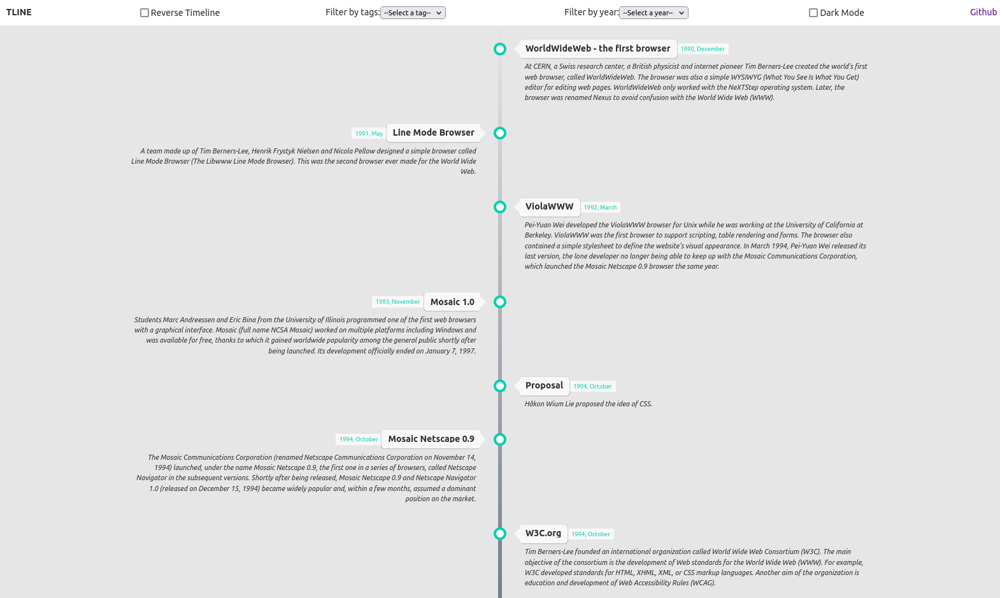
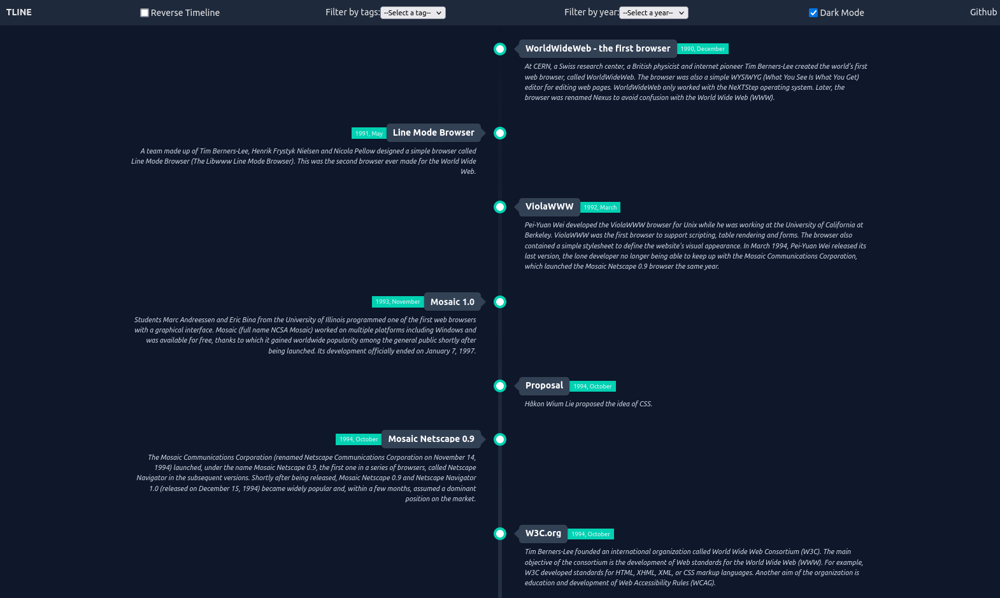

# [`tline`](https://tline.vercel.app/)

Time line for the CSS evolution and history of tooling, libraries, frameworks and so on

## Features

- Zero dependencies 💯
- dark mode support 🌓
- reverse timeline is supported 🔃
- sort timeline by default ✂️
- support filter using tags and year 📆
- Build using [`typescript`](https://www.typescriptlang.org/)
- JavaScript code linting is done using [`eslint`](https://www.npmjs.com/package/eslint)
- Has [`.editorconfig`](https://editorconfig.org/) which helps developers define and maintain consistent coding styles between different editors and IDEs.

|  |  |
| -------------------------------------- | ------------------------------------ |

## Installation

```shell
npm i tline
# Or
yarn add tline
```

## Before starting

the event (data) should be similar to:

all properties are `required` expect `url` is `optional`

```js
...
{
  name: 'Bootstrap',
  url: 'https://getbootstrap.com',
  description: 'The most popular HTML, CSS, and JS library in the world.',
  createdAt: new Date(2011, 7, 19),
  tags: ['frameworks'],
},
...
```

## Usage 🚀

```jsx
import Tline from 'Tline';

const events = [] // your events as previously structured

<Tline timeline={events} />
```

## Available `props`

| property   | type      | default | description                                                        |
| ---------- | --------- | ------- | ------------------------------------------------------------------ |
| `tag`      | `string`  | `all`   | filter timeline by events tag                                      |
| `year`     | `number`  | `0`     | filter timeline by events year                                     |
| `reversed` | `boolean` | `false` | determine if timeline is reversed or not default is sorted by date |
| `darkmode` | `boolean` | `false` | activate `darkmode`                                                |

## Playground

```jsx
const [setting, setSetting] = useState({
  tag: 'all',
  year: 0,
  reversed: false,
  darkmode: false,
  timeline: data,
});

return (
  <div className={`app ${setting.darkmode ? 'darkmode' : ''}`}>
    <Tline {...setting} />
  </div>
);
```

## Related Work 🌠

- [`tube-cli`](https://github.com/mohammed-Taysser/tube-cli) - A package for downloading youtube videos & playlists
- [`tube-info`](https://github.com/mohammed-Taysser/tube-info) - A package for getting youtube videos & playlists info
- [`js-pmq`](https://github.com/mohammed-Taysser/pmq) - A simple NPM package to get popular movie quotes.

## Data sources

- [`awesome-css`](https://github.com/awesome-css-group/awesome-css)
- [`awesome-css-frameworks`](https://github.com/troxler/awesome-css-frameworks)
- [`wikipedia`](https://www.wikipedia.org/)
- [`w3.org - tag=css`](https://www.w3.org/TR/?tag=css&status=REC)
- [`w3.org - specs.en`](https://www.w3.org/Style/CSS/specs.en.html)
- [`timeline-1998-2002`](https://www.webdesignmuseum.org/web-design-history/timeline-1998-2002)

## Contribution 🤝

1. Fork it!
2. Create your feature branch: `git checkout -b feature-name`
3. Commit your changes: `git commit -am 'Some commit message'`
4. Push to the branch: `git push origin feature-name`
5. Submit a pull request 😉😉

## License 📜

MIT © [`Mohammed Taysser`](https://github.com/mohammed-Taysser/)
